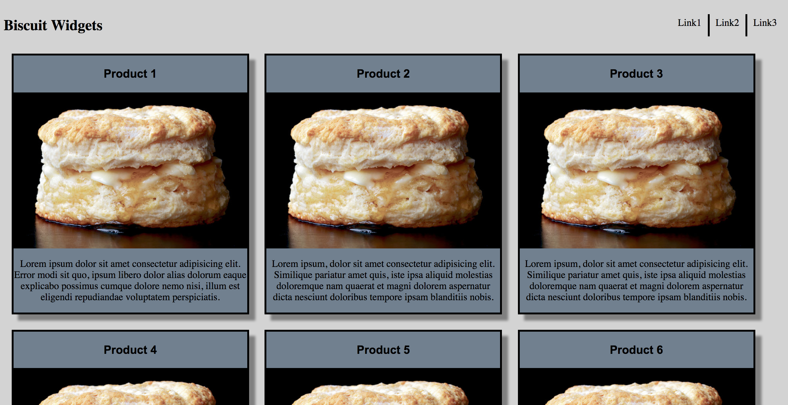

# HTML-CSS101

This was an in-class project to get familiar with basic html and basic css styling.

Basically a products page for a business

## Screenshots

​

## How to run this project:

* Use nmp to install htpp-server:

```sh

npm install -g http-server

```
* Run the server:

```sh

hs -p 9999

```

* Open Chrome and navigate to:

```

localhost:9999

```


​
